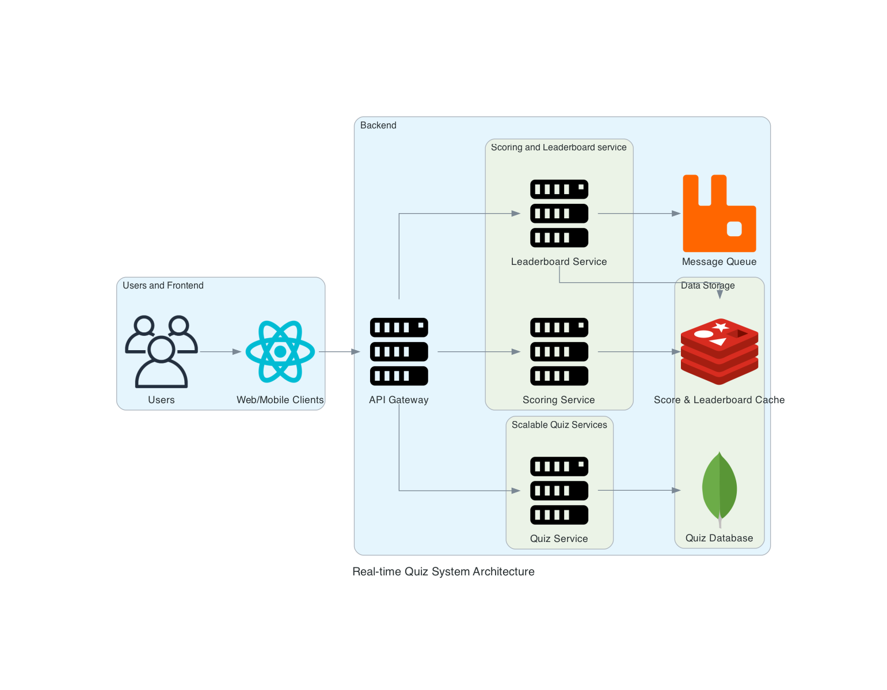

# Real-Time Quiz System Architecture

## Users

- **End-users of the quiz system.**
- Interact with the system through web or mobile interfaces.

## Web/Mobile Clients (React)

- **Frontend applications that users interact with.**
- Built using React for responsive and interactive user interfaces.
- Communicate with backend services via REST API and WebSockets.

## API Gateway

- **Entry point for all client requests.**
- Handles routing, load balancing, and potentially authentication/authorization.
- Directs requests to appropriate microservices.

## Quiz Service (Spring WebSocket)

- **Core service for managing quiz sessions.**
- Implemented in Java using Spring framework with WebSocket support.
- Handles real-time quiz progression, question delivery, and answer submission.
- Maintains WebSocket connections with clients for instant communication.

## Scoring Service

- **Processes submitted answers and calculates scores.**
- Updates user scores in real-time.
- Publishes score updates to the message queue.

## Leaderboard Service

- **Manages and updates the real-time leaderboard.**
- Consumes score updates from the message queue.
- Updates leaderboard data in the cache.
- **Pushes real-time updates to clients (e.g., score changes, leaderboard updates).**
- Consumes events from the message queue and broadcasts to relevant clients.

## Quiz Database (MongoDB)

- **Stores quiz content, questions, and session data.**
- NoSQL database for flexibility in quiz structure.

## Score & Leaderboard Cache (Redis)

- **In-memory data store for fast access to current scores and leaderboard data.**
- Enables quick reads and writes for real-time updates.

## Message Queue (RabbitMQ)

- **Facilitates asynchronous communication between services.**
- Ensures reliable delivery of events like score updates.
---

This architecture enables a scalable, real-time quiz system with separation of concerns among different services. The use of WebSockets in the Quiz Service allows for instant bidirectional communication, while the message queue and cache enable efficient data flow and state management across the system.
